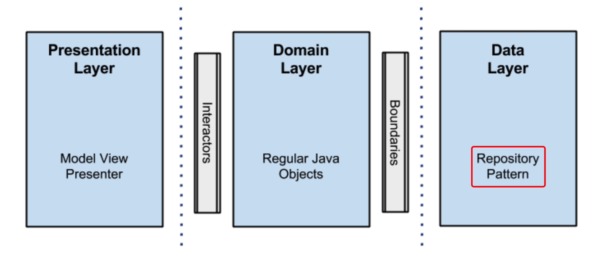

[toc]


## 图


## begin

> 为了分离关注点，将项目分为3层。

不要误以为每一层对应上图的一个圆环。上图的重点在于，说明**依赖原则**。

我们之所以会有这样的误会是因为项目中的domain 模块跟圆图中的最内domain logic同名，但这是不正确的理解。

根据我的理解，每一层都含有圆圈内的部分圆环。但无论如何，重点在于**依赖原则**不发生改变。

证据如下：


domain层包含了usecase和entities


### data layer



这一层就是个Repository Pattern 模式。作为数据的提供者。


> ```
> 这个package 对`UserEntity.java`  进行了依赖
> 这个package 使用了 okhttp ，这算是framework,算是工具吧，那应该算是最外层吧。
> ```


### domain


这个`domain`包应该包含了圆圈中的：`Entities`和`use cases`


### Presentation

个人理解，这里的presentation<sup>表示层</sup>虽然与MVP中的presenter<sup>主持人</sup>英文看着相似，但应该是两个意思。

这里的presentation理解为整个项目的视图层，表现层。不恰当的说，好比是MVP中的View


> but here **fragments and activities are only views**, there is no logic inside them other than UI logic, and this is where all the rendering stuff takes place.

但这里的`fragments` and `activities`只是视图，除了 **UI 逻辑**之外，它们内部没有任何逻辑，所有渲染的东西都是在这里发生的


